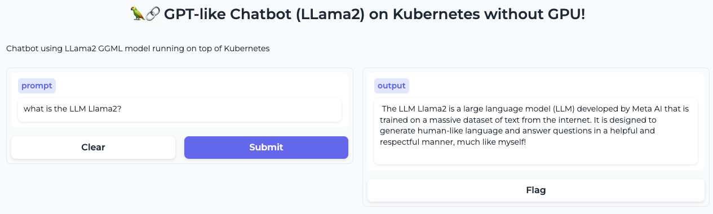

# Llama2 in Kubernetes with Gradio only with CPU (no GPU required)!

This repo uses GGML Llama2 Optimization models to run the Llama2 13B model on a CPU (no GPU needed!) 



* Performance in AMD EPYC 7R32, 8vCPUs and 32gb RAM -> 15 seconds

```md
kubectl logs -f -n k8s-llama2 deploy/k8s-llama2 --tail=15

llama_print_timings:        load time =  9663.88 ms
llama_print_timings:      sample time =    96.66 ms /   113 runs   (    0.86 ms per token,  1169.06 tokens per second)
llama_print_timings: prompt eval time =  2489.89 ms /    11 tokens (  226.35 ms per token,     4.42 tokens per second)
llama_print_timings:        eval time = 32794.48 ms /   112 runs   (  292.81 ms per token,     3.42 tokens per second)
llama_print_timings:       total time = 35630.38 ms
Llama.generate: prefix-match hit
```

## GGML for Llama2

GGML was designed to be used in conjunction with the llama.cpp library, also created by Georgi Gerganov. The library is written in C/C++ for efficient inference of Llama models. It can load GGML models and run them on a CPU. Originally, this was the main difference with GPTQ models, which are loaded and run on a GPU. 

## Prerequisites

* Deploy Nginx Ingress Controller:

```md
kubectl apply -f https://raw.githubusercontent.com/kubernetes/ingress-nginx/master/deploy/static/provider/kind/deploy.yaml
```

* Deploy Nvidia GPU Operator

```md
helm repo add nvidia https://helm.ngc.nvidia.com/nvidia || true
helm repo update
helm install --wait --generate-name \
     -n gpu-operator --create-namespace \
     nvidia/gpu-operator --set driver.enabled=false
```

* Deploy Pod to Check nvidia-smi
```md
kubectl apply -f - << EOF
apiVersion: v1
kind: Pod
metadata:
  name: cuda-vectoradd
spec:
  restartPolicy: OnFailure
  containers:
  - name: cuda-vectoradd
    image: "nvcr.io/nvidia/k8s/cuda-sample:vectoradd-cuda11.7.1-ubuntu20.04"
    resources:
      limits:
        nvidia.com/gpu: 1
EOF
docker exec -ti k8s-control-plane ln -s /sbin/ldconfig /sbin/ldconfig.real
kubectl delete --all pod -n gpu-operator
```

## Deploy Llama2 in Kubernetes

* Deploy Llama2 in Kubernetes

```md
kubectl apply -k manifests/overlays/
```

## Development

* Adjust the Makefile variables with your own specs.

* You can modify the image base and use your own:

```md
make all
```